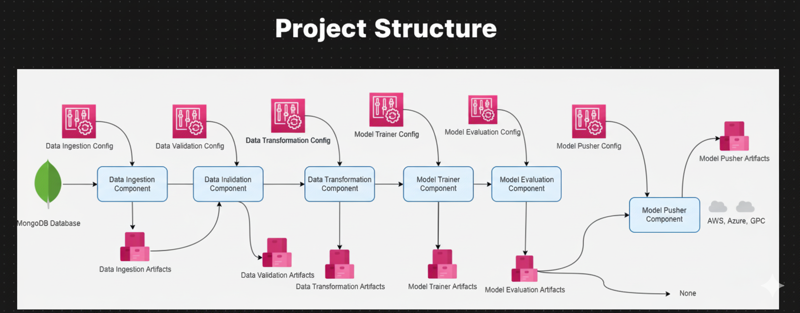

### MLOps - scarce data operational setup

### components
 - Data Ingestion
 - Validation
 - Transformation 
 - Trainer Evaluation
 - Pusher

### scarce Models options
 - Gaussian process regressor
 - sparce Gaussian processes
 - Deep Gaussian processes
 - Bayesian optimization with GP surrogate
 - Multi output /multi task GPs

### Planned modules
 - Automated feature engineering
 - AutoML integration
 - Meta Learning layer
 - bayesian optimization 
